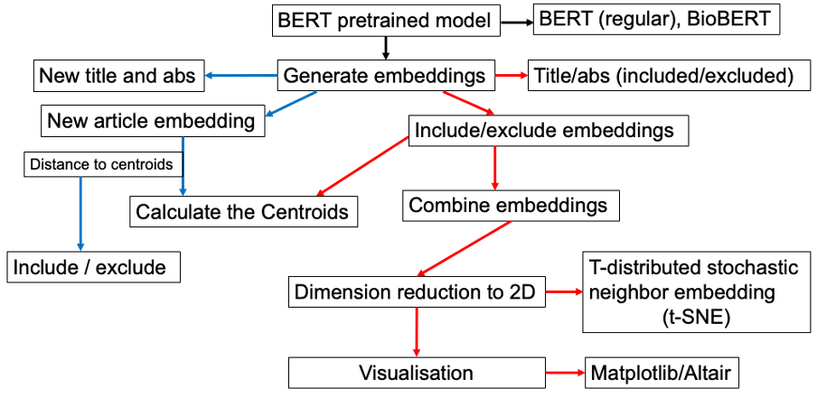

# Automated screening of articles by title and abstracts

## Abstract
* Motivation / Rationale
* Methods
  
* Results
*     Implementation
*     Validation
* Conclusion

## Data availability
The data used in this work are found ...
## Software
The software needed to run ...
## Usage
To use this you need to ...

# Acknowledgement
This piece of work was ...

## Authors
1. Winfred Gatua
2. Yi Liu
3. Deborah Lawlor
4. Tom Gaunt

